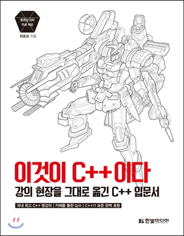

# ThisIsCPlusPlus

  <kbd></kbd>

  Chap 01 C와는 다른 C++ <a href="./src/chap-01">소스</a> 
  Chap 02 C++ 함수와 네임스페이스 <a href="./src/chap-02">소스</a> 
  Chap 03 클래스 <a href="./src/chap-03">소스</a> 
  Chap 04 복사 생성자와 임시 객체 <a href="./src/chap-04">소스</a> 
  Chap 05 연산자 다중 정의 <a href="./src/chap-05">소스</a> 

